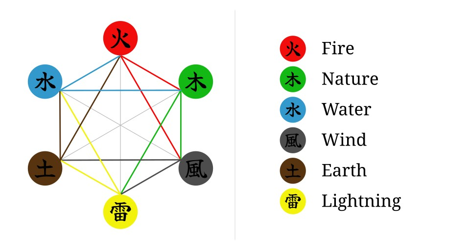

# CardNinja

  

Remake of the game [Carta Ninja](https://github.com/Samurai-Turtles/Carta-Ninja),
initially developed as a project for the course of Computer Science at 
[Federal University of Campina Grande (UFCG)](https://www.computacao.ufcg.edu.br/).

All credits go to the team of [Samurai Turtles](https://github.com/Samurai-Turtles).

## Table of Contents

- [Introduction](#introduction)
- [Downloading and running](#downloading-and-running)
- [Game rules and mechanics](#game-rules-and-mechanics)

## Introduction

CardNinja is a card game where you use elemental powers to defeat your enemies.
You have to fight against five powerful warriors and pave your way up to the 
title of Grandmaster, using a variety of elemental cards trick and smash your
opponents in your way to the top.

## Downloading and running

Currently, the game is under development and is not playable yet. As soon as its
avaliable, this section will be updated with the instructions on how to download
and run CardNinja.

## Game rules and mechanics

The game has a campaign system, where the player has to **defeat five warriors**
to win. The battles against each warrior are **ten round matches**, where the 
**player uses a deck of cards against the warrior's deck** to defeat them and to
**score as much points as possible**. In each round, the cards chosen by the player and 
the warrior are compared, and the **power of the winner's card is added to 
its score**.

In CardNinja, **all cards have an elemental trait and a power value**. There are
six elements (`fire`, `nature`, `wind`, `lightning`, `earth` and `water`) and
three power levels (`2`, `5`, and `7`), which totals **18 unique cards**.

Players win rounds either by element relation or power level. *Each element has 
a dominance over other two elements* and a *equivalence relation to one other*. 
A player wins a round if:

- The element of their card has **dominance over the opponent's card**
- The elements of the cards are equivalent (or equal), but their card has a 
  **higher power level**

The elemental relations present in the game are illustrated below. **Colored 
lines represent the dominant element of the relation** and **gray
lines indicate that the elements are equivalent**.

The match ends at the end of ten rounds of if one of the following conditions 
are met:

- One player wins **three consecutive rounds**
- One player wins **with five different elements in the same match**

If none of those conditions are met by the end of the tenth round, the winner
will be **the player with the highest score in the match**. After you win a 
match, *the score of the match will be added to the campaign total score*.

The game also has a **life system**: at the start of every new campaign, you 
have **two extra lifes**. *Each match you lose decreases your lifes by one 
point*. The campaign ends either by **defeating all the warriors** or by 
**losing all your lifes**. After the campaign ends, **the game saves a record of
 it in the Ranking tab**, which includes the campaign name and total score.
